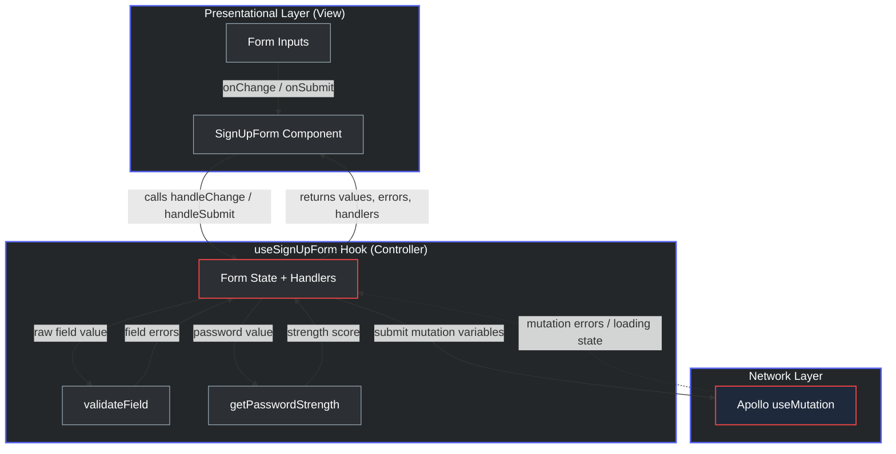

# Guest Site Authentication & Account Lifecycle Engine

## Project Overview
This repository showcases the high-level system design and architectural patterns implemented for the guest onboarding and user lifecycle platform at **SoCoders**. The architecture establishes a highly maintainable, secure, and performant frontend system managing critical guest spaces, including **User Creation (Sign-Up)**, **Authorization (Login)**, and self-service **Account Recovery (Password Restoration)**.

The core engineering focus was to isolate complex business logic, reactive client-side security validation, and asynchronous state synchronization away from presentation layouts.

---

## Core Tech Stack & Design Patterns
* **Framework Layer:** React with TypeScript
* **Data & Network Architecture:** GraphQL via Apollo Client 
* **Architectural Pattern:** Controller-Service (Smart-Dumb Component Abstraction)
* **Validation Strategy:** Polymorphic Client-Side Parsing Engine

---

## System Architecture & Design Choices

### 1. Controller-Service Decoupling (Separation of Concerns)
To maximize code maintainability and testability, the module strictly decouples business rules from layout configurations. 
* **The Controller Layer:** A functional hub that manages local form states, handles form execution events, tracks input boundaries, and acts as the gatekeeper for network transactions.
* **The View Layer:** A "dumb" presentation wrapper that strictly renders user interfaces based on structural properties passed from the controller, remaining entirely unaware of underlying API implementations.

### 2. Client-Side Cryptographic Strength Scoring
Rather than waiting for downstream server validations, the architecture utilizes a real-time parsing engine during active typing phases. It dynamically maps password characteristics against complexity matrices to expose a completion percentage and active safety checks. This drastically mitigates unnecessary API roundtrips and optimizes frontend performance.

### 3. Polymorphic Validation Contracts
To accommodate rich UI feedback specifications (such as interactive links or icons within field errors), the form tracking structures use a strict type union allowing validation errors to evaluate dynamically as either standard text strings or functional layout nodes.

---

## Engineering Impact & Core Outcomes

| Technical Challenge | Strategic Engineering Solution | Core Engineering Impact |
| :--- | :--- | :--- |
| **High Component Coupling** | Abstracted domain, validation rules, and mutation states into isolated Controllers. | Achieved **100% test isolation** for auth verification logic, allowing independent testing without UI layout dependencies. |
| **Unnecessary Server Rejections** | Integrated real-time password requirement matrix evaluation on the client view. | **Minimized invalid API submission workflows** by catching structural input issues prior to network transport. |
| **Fragile Client-Server Data Contracts** | Embedded automated schema-driven GraphQL hooks via code generation utilities. | Handled asynchronous states smoothly to **prevent runtime contract breakdowns** between network outputs and component structures. |

* **The Controller Layer:** A functional hub that manages local form states, handles form execution events, tracks input boundaries, and acts as the gatekeeper for network transactions.
* **The View Layer:** A "dumb" presentation wrapper that strictly renders user interfaces based on structural properties passed from the controller, remaining entirely unaware of underlying API implementations.

